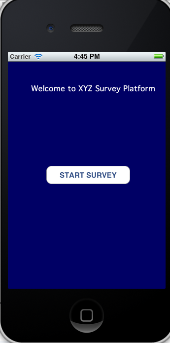
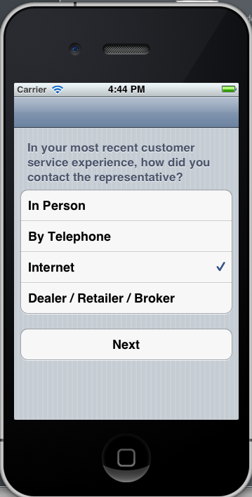
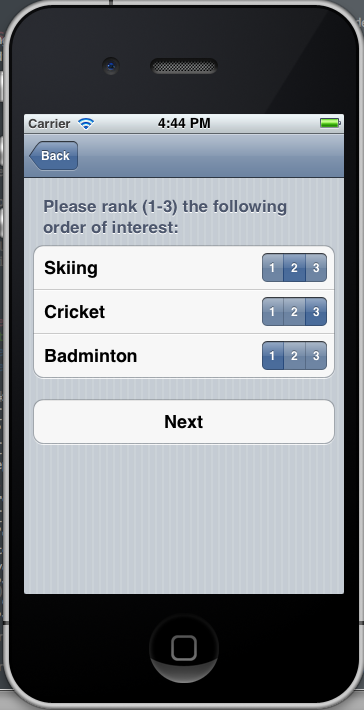
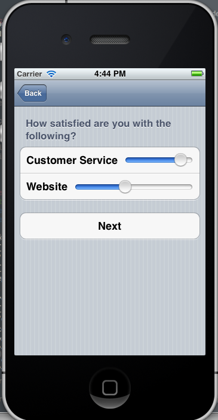
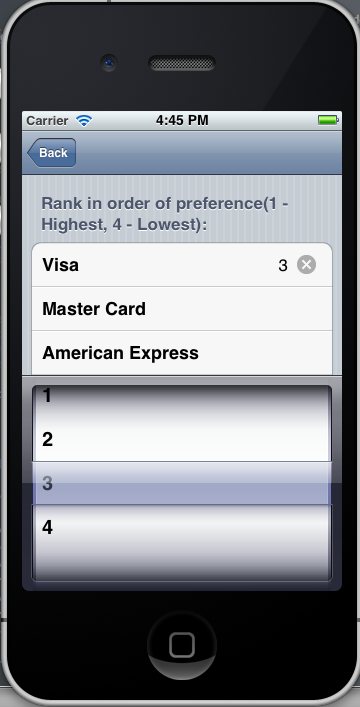

## Survey tool for iOS (iPhone and iPad)

Create your Surveys on iOS dynamically without the need to Compile and Push to app store.
The views are controlled by JSON. The sample json:

```ruby


```

For deatils of JSON look at ``resources\questions.json`` for reference.

The screenshot of current implementation:



* Other pages:









## Forking

Feel free to fork and submit pull requests!

## Todo

- Create views for iPad, current views are only for iPhone
- Create RailsAPI which feeds JSON when online.
- Improve storage - UIDocument or CoreData or FMDB